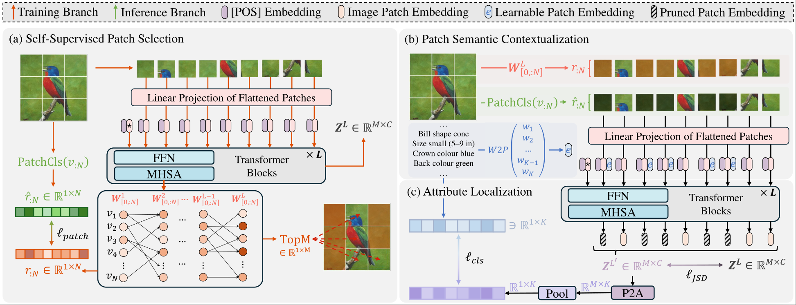

## Zero-Shot Learning

|  | [**SVIP: Semantically Contextualized Visual Patches for Zero-Shot Learning**](https://arxiv.org/pdf/2503.10252)   **Zhi Chen**, Zecheng Zhao, Jingcai Guo, Jingjing Li, Zi Huang    *Pre-Print*   [arXiv](https://arxiv.org/pdf/2503.10252) |
| --- | --- |

- Jingcai Guo, Zhijie Rao, **Zhi Chen**, Song Guo, Jingren Zhou, Dacheng Tao  
  [On the Element-Wise Representation and Reasoning in Zero-Shot Image Recognition: A Systematic Survey](https://arxiv.org/pdf/2408.04879).  
  *Pre-Print*.
  
- **Zhi Chen**, Pengfei Zhang, Jingjing Li, Sen Wang, Zi Huang  
  [Zero-Shot Learning by Harnessing Adversarial Samples](https://arxiv.org/pdf/2308.00313.pdf).  
  *ACM International Conference on Multimedia*.
  
- **Zhi Chen**, Yadan Luo, Sen Wang, Jingjing Li, Zi Huang  
  [Federated Zero-Shot Learning for Visual Recognition](https://arxiv.org/pdf/2209.01994).  
  preprint, 2022.

- **Zhi Chen**, Yadan Luo, Sen Wang, Jingjing Li, Zi Huang  
  [GSMFlow: Generation Shifts Mitigating Flow for Generalized Zero-Shot Learning](https://arxiv.org/abs/2207.01798)  
  *IEEE Transactions on Multimedia (TMM)*. 2022. (Core A*) (IF: 8.182)

- Hongzu Su, Jingjing Li, **Zhi Chen**, Lei Zhu, Ke Lu  
  [Distinguishing Unseen from Seen for Generalized Zero-shot Learning](https://openaccess.thecvf.com/content/CVPR2022/papers/Su_Distinguishing_Unseen_From_Seen_for_Generalized_Zero-Shot_Learning_CVPR_2022_paper.pdf),
  *The IEEE/CVF Conference on Computer Vision and Pattern Recognition (CVPR)* 2022. (Core A*)

- **Zhi Chen**, Yadan Luo, Ruihong Qiu, Sen Wang, Zi Huang, Jingjing Li, Zheng Zhang  
  [Semantics Disentangling for Generalized Zero-Shot Learning](https://arxiv.org/pdf/2101.07978.pdf)  
  *IEEE/CVF International Conference on Computer Vision (ICCV)* 2021. (Core A*)

- **Zhi Chen**, Yadan Luo, Sen Wang, Ruihong Qiu, Jingjing Li, Zi Huang  
  [Mitigating Generation Shifts for Generalized Zero-Shot Learning](https://arxiv.org/abs/2107.03163)  
  ACM International Conference on Multimedia (MM) 2021. (Core A*)

- **Zhi Chen**, Zi Huang, Jingjing Li, Zheng Zhang  
  [Entropy-Based Uncertainty Calibration for Generalized Zero-Shot Learning](https://arxiv.org/pdf/2101.03292.pdf)  
  *2021 Australasian Database Conference.* (Best student paper – Highly Commended)

- **Zhi Chen**, Jingjing Li, Yadan Luo, Zi Huang, Yang Yang  
  [CANZSL: Cycle-Consistent Adversarial Networks for Zero-Shot Learning from Natural Language](https://arxiv.org/pdf/1909.09822)  
  *The IEEE Winter Conference on Applications of Computer Vision (WACV)* 2020. (Core A)

- **Zhi Chen**, Sen Wang, Jingjing Li, Zi Huang  
  [Rethinking Generative Zero-Shot Learning: An EnsembleLearning Perspective for Recognising Visual Patches](https://arxiv.org/pdf/2007.13314.pdf)  
  *ACM International Conference on Multimedia 2020.* (Core A*)

## General Computer Vision and Machine Learning

- Zhiqi Yu, Zhichao Liao, Jingjing Li, Zhi Chen, Lei Zhu  
  [Dynamic Target Distribution Estimation for Source-free Open-Set Domain Adaptation]()  
  *The 39th Annual AAAI Conference on Artificial Intelligence* AAAI 2024 (Core A*)

- Jia Syuen Lim, Zhuoxiao Chen, **Zhi Chen**, Mahsa Baktashmotlagh, Xin Yu, Zi Huang, Yadan Luo  
  [DiPEx: Dispersing Prompt Expansion for Class-Agnostic Object Detection](https://arxiv.org/pdf/2406.14924)  
  *NeurIPS* 2024. (Core A*)

- **Zhi Chen**, Zecheng Zhao, Yadan Luo, Zi Huang  
  [FastEdit: Fast Text-Guided Single-Image Editing via Semantic-Aware Diffusion Fine-Tuning](https://arxiv.org/pdf/2408.03355)  
  *preprint* 2024.

- Yi Zhang, Sen Wang, **Zhi Chen**, Xuwei Xu, Stano Funiak, Frank de Hoog, Jiajun Liu  
  [Towards Cost-Efficient Federated Multi-Agent Reinforcement Learning with Learnable Aggregation](https://openreview.net/pdf?id=nbN8Ilbg8c)  
  *The Pacific-Asia Conference on Knowledge Discovery and Data Mining* (PAKDD) 2024. (Best Student Paper Award)

- **Zhi Chen**, Xin Yu, Zi Huang  
  [Don't Paint Everyone with the Same Brush: Adaptive Prompt Prototype Learning for Vision-Language Models](https://openreview.net/pdf?id=YG01CZDpCq)  
  *Pre-print* 2024.
  
- Xinyi Yang, **Zhi Chen**, Yadan Luo  
  [Optimizing Taxi Route Planning Based on Taxi Trajectory Data Analysis](https://link.springer.com/chapter/10.1007/978-3-031-47843-7_4)  
  *Australasian Database Conference* (ADC) 2023.
  
- Fuming You, Jingjing Li, **Zhi Chen**, Lei Zhu  
  [Pixel Exclusion: Uncertainty-aware Boundary Discovery for Active Cross-Domain Semantic Segmentation](https://dl.acm.org/doi/abs/10.1145/3503161.3548079)  
  *ACM International Conference on Multimedia* (MM) 2022. (Core A*)

- Fuming You, Jingjing Li, Lei Zhu, **Zhi Chen**, Zi Huang  
  [Domain Adaptive Semantic Segmentation without Source Data](https://dl.acm.org/doi/10.1145/3474085.3475482)  
  *ACM International Conference on Multimedia* (MM) 2021. (Core A*)

- Yudong Chen, Sen Wang, Jianlin Lu, **Zhi Chen**, Zheng Zhang, Zi Huang  
  [Local Graph Convolutional Networks for Cross-Modal Hashing](https://dl.acm.org/doi/10.1145/3474085.3475346)  
  *ACM International Conference on Multimedia* (MM) 2021. (Core A*)
  
- Ruihong Qiu, Sen Wang, **Zhi Chen**, Hongzhi Yin, Zi Huang  
  [CausalRec: Causal Inference for Visual Debiasing in Visually-Aware Recommendation](https://arxiv.org/abs/2107.02390)  
  *ACM International Conference on Multimedia* (MM) 2021. (Core A*)
  
## Digital Agriculture
- Tianqi Wei, **Zhi Chen**, Xin Yu, Scott Chapman, Paul Melloy, Zi Huang  
  [PlantSeg: A Large-Scale In-the-wild Dataset for Plant Disease Segmentation](https://arxiv.org/pdf/2409.04038)  
  preprint 2024.
  
- Tianqi Wei, **Zhi Chen**, Zi Huang, Xin Yu  
  [Benchmarking In-the-wild Multimodal Disease Recognition and A Versatile Baseline](https://openreview.net/forum?id=nycUC9g6IO&referrer=%5Bthe%20profile%20of%20Xin%20Yu%5D)  
  *ACM International Conference on Multimedia (MM)* 2024. (Core A*)
  
- **Zhi Chen**, Tianqi Wei, Zecheng Zhao, Jia Syuen Lim, Yadan Luo, Hu Zhang, Xin Yu, Scott Chapman, Zi Huang  
  [CF-PRNet: Coarse-to-Fine Prototype Refining Network for Point Cloud Completion and Reconstruction](https://arxiv.org/pdf/2409.08443)  
  *1st Place solution to CVPPA@ECCV2024: Shape Completion and Reconstruction of Sweet Peppers Challenge.*

- Jia Syuen Lim, Yadan Luo, **Zhi Chen**, Tianqi Wei, Scott Chapman, Zi Huang  
  [Track Any Peppers: Weakly Supervised Sweet Pepper Tracking Using VLMs](https://arxiv.org/pdf/2411.06702)  
  *2st Place solution to CVPPA@ECCV2024: Detection and Multi-Object Tracking of Sweet Peppers Challenge.*

## HealthCare

- Weihao Wang, Xiaobei Li, Fei Chen, Ran Wei, **Zhi Chen**, Jingjing Li, Jingtao Qiao, Qi Pan, Wenjing Yang, Lixin Guo  
  [Secondary analysis of newly diagnosed type 2 diabetes subgroups and treatment responses in the MARCH cohort](https://www.sciencedirect.com/science/article/pii/S1871402123002321)  
  *Diabetes & Metabolic Syndrome: Clinical Research & Reviews.* 2024. (IF:10.0)
  
- Weihao Wang\*, **Zhi Chen**\*,  Sen Wang, Fei Chen, Mingqun Deng, Qi Pan, Lixin Guo  
  [Application of novel subgroups of Chinese inpatients with diabetes based on machine learning paradigm](https://www.sciencedirect.com/science/article/abs/pii/S1871402122001709)  
  *Diabetes & Metabolic Syndrome: Clinical Research & Reviews*. 2022. (JCR Q1) (IF:10.0) (Co-first Author)

- Weihao Wang, Xiaobei Pei, Lina Zhang, **Zhi Chen**, Dong Lin, Xiaoye Duan, Jingwen Fan, Qi Pan, Lixin Guo  
  [Application of new international classification of adult-onset diabetes in Chinese inpatients with diabetes mellitus](https://onlinelibrary.wiley.com/doi/epdf/10.1002/dmrr.3427)  
  *Diabetes/Metabolism Research and Reviews. 2021.* (IF: 8.02)

- Xi Chen, **Zhi Chen**, Zijian Wang, Ruihong Qiu, Yadan Luo  
  [FluMA: An Intelligent Platform for Influenza Monitoring and Analysis](https://link.springer.com/chapter/10.1007/978-3-031-15512-3_12)  
  *Australasian Database Conference* 2022.

